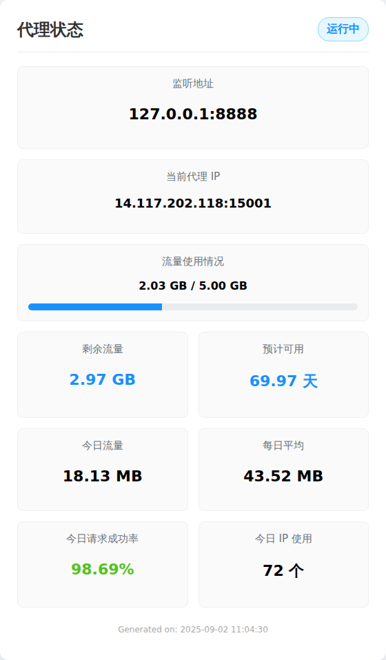

# Asrbot IP代理插件

<p align="center">
  
  &nbsp;
  
  &nbsp;
  
  &nbsp;
  
  &nbsp;
  
</p>
通过 AstrBot 将远程 HTTP 代理 API 转换为一个本地代理服务。并能通过bot在聊天平台使用命令使用和监控代理服务。<s>再也不怕被库洛封ip了</s>

---


## 🗎 功能特性

  * **API 转本地代理:** 将任何返回 `ip:port` 格式的 HTTP 代理 API 转换为一个稳定可用的本地 HTTP 代理。可以本地使用或者中转到其他服务器供他人使用。
  * **智能 IP 管理:** 自动获取、验证、切换代理 IP，并支持根据设定的时间强制更新 IP，以适配动态 IP 的失效时间。
  * **可视化状态看板:** 可选的精美图片看板，将代理状态、流量统计等数据一图汇总，直观易读。
  * **域名白名单:** 仅代理白名单中的域名请求，防止滥用和意外流量消耗。
  * **数据统计与持久化:** 实时统计和记录总/今日使用流量、请求成功/失败数、IP 使用量，数据采用原子写入方式，在机器人重启后依然保留。
  * **流量限制:** 可设置总流量限制，达到上限后自动拒绝新连接。
  * **全指令化操作:** 通过聊天指令控制代理的启停、状态查询、IP切换及所有配置项的动态修改。
  * **缓存自动清理:** 可视化看板生成的图片缓存会自动清理，默认只保留10分钟，节省磁盘空间。
  * **易于配置:** 可在 AstrBot 的 WebUI 可视化配置，也可通过机器人指令配置。
  * **权限控制:** 所有管理指令均需 AstrBot 管理员权限。

## 🛠️ 安装方法

1.  **进入插件目录：** 进入您的 AstrBot 的 `data/plugins` 目录。
2.  **克隆仓库:** 使用 `git` 克隆本插件仓库。
    ```bash
    git clone https://github.com/timetetng/astrbot_plugin_ip_proxy.git
    ```
3.  **安装依赖:** 进入插件目录，安装所需的依赖库。
    ```bash
    cd astrbot_plugin_ip_proxy
    pip install -r requirements.txt
    ```
    如果您使用 `uv`，指令为 `uv pip install -r requirements.txt`。
4.  **安装 Playwright 浏览器:** (仅在需要使用可视化卡片功能时需要)
    ```bash
    playwright install
    ```
5.  **重启 AstrBot：** 重启您的 AstrBot 服务以加载插件。插件首次运行后，会在 `data/plugin_data/astrbot_plugin_ip_proxy/` 目录下自动创建 `stats.json` 用于存放统计数据。

## ⚙️ 配置方法

您可以通过两种方式配置此插件，通过指令修改的配置会实时生效并覆盖原有配置。

  * **后台配置 (推荐首次配置):**

    1.  启动 AstrBot 后，访问其 Web 管理界面。
    2.  在插件管理中找到 `astrbot_plugin_ip_proxy`。
    3.  在表单中填写您的 API 地址、监听端口等信息并保存。

  * **指令配置 (推荐动态修改):**

      * 在聊天中向机器人发送指令来修改配置，详见下文指令列表。

## 📄 配置项说明

| 配置项 | 类型 | 默认值 | 描述 |
| :--- | :--- | :--- | :--- |
| `enable_visual_status` | `bool` | `false` | **(新)可视化状态:** `/代理状态` 是否以图片形式展示。开启此功能需要额外安装依赖。 |
| `start_on_load` | `bool` | `true` | **自动启动:** 插件加载时是否自动开启代理服务。 |
| `api_url` | `string` | `"http://..."` | **代理API地址:** 用于获取代理IP的URL。**必须**替换为您自己的有效API。API应返回纯文本 `IP:PORT` 格式。 |
| `listen_host` | `string` | `"127.0.0.1"` | **监听地址:** 本地代理的监听IP。`127.0.0.1`仅本机可用，`0.0.0.0`可供局域网或公网访问。修改后需重启代理。 |
| `local_port` | `int` | `8888` | **监听端口:** 本地代理的监听端口。修改后需重启代理。 |
| `allowed_domains` | `list` | `["..."]` | **(重要)域名白名单:** 代理仅转发目标域名在此列表中的请求。建议全小写。 |
| `validation_url` | `string` | `"http://www.baidu.com"` | **验证URL:** 通过代理访问此地址来测试获取到的IP是否可用。 |
| `validation_interval` | `int` | `60` | **验证间隔(秒):** 一个有效的IP在此时间内不会被重复验证，以提升性能。 |
| `validation_timeout` | `int` | `5` | **验证超时(秒):** 访问验证URL的超时时间，超时则认为IP无效。 |
| `ip_expiration_time` | `int` | `300` | **IP绝对失效时间(秒):** IP自获取起，超过此时长将被强制更换。设为`0`则永不强制更换。 |
| `connect_timeout` | `int` | `10` | **连接超时(秒):** 连接到代理IP的超时时间。若代理商网络较慢可适当调高。 |

## 🚀 使用教程

0.  **获取:** 通过IP代理服务商获取提取API，注意本插件兼容的API提取格式为 HTTP协议、TXT格式、一次一个IP、回车换行(`\r\n`)。
1.  **配置:** 在后台或使用指令正确配置 `api_url` 和 `allowed_domains`。
2.  **启动:** 发送指令 `开启代理`。如果 `start_on_load` 为 `true`，此步可省略。
3.  **检查:** 发送指令 `代理状态` 查看服务是否正常运行，监听地址和当前IP是否正确。
4.  **使用:**
      * **本地使用:** 当 `listen_host` 为 `127.0.0.1` 时，代理地址为 `http://127.0.0.1:监听端口`。
      * **公网使用:** 当 `listen_host` 为 `0.0.0.0` 时，代理地址为 `http://服务器公网IP:监听端口`。

**⚠️ 安全提示:**

  * 在公网使用 (`0.0.0.0`) 时，**务必**在您的服务器防火墙（安全组）中设置规则，只允许您信任的IP地址访问监听端口，避免代理被盗刷！
  * 将日志等级调整为 `Debug` 可以看到更详细的连接和IP验证日志。

## 💻 指令列表

**注意：** 以下所有指令都需要AstrBot管理员权限才能执行。

-----

### 🛡️ 服务控制

  * **开启代理**

      * **主指令:** `开启代理`
      * **别名:** `启动代理`, `代理开启`
      * **作用:** 在指定的地址和端口上启动本地代理服务。

  * **关闭代理**

      * **主指令:** `关闭代理`
      * **别名:** `代理关闭`, `取消代理`
      * **作用:** 停止本地代理服务。

  * **代理状态**

      * **主指令:** `代理状态`
      * **作用:** 显示插件的详细运行状态、统计数据和当前配置。
      * **输出模式:**
          * 当配置项 `enable_visual_status` 为 `false` (默认)时，返回**纯文本**信息。
          * 当配置项 `enable_visual_status` 为 `true` 时，返回一张精美的**可视化状态卡片**。
      * **可视化卡片预览:**

      

      * **纯文本示例:**
        ```text
        --- IP代理插件状态 ---
        运行状态: ✅运行中
        监听地址: 127.0.0.1:8888
        当前代理IP: 123.45.67.89:1234
        --------------------
        总流量限制: 10.00 GB
        总使用流量: 1.25 GB
        剩余流量: 8.75 GB
        今日使用流量: 150.32 MB
        每日平均流量 (最近3天): 200.00 MB
        预计可用天数: 44.80 天
        今日请求成功率: 98.50% (197/200)
        IP总使用量: 50
        今日IP使用量: 5
        --------------------
        白名单域名: gmserver-api.aki-game2.com, api.kurobbs.com
        ```

  * **切换IP**

      * **主指令:** `切换IP`
      * **作用:** 强制使当前代理IP失效，并立即从API获取一个新的IP。

-----

### 📈 流量管理

  * **设置总流量 `[流量大小]`**

      * **主指令:** `设置总流量 <流量大小>`
      * **示例:** `/设置总流量 5GB`, `/设置总流量 1000MB`
      * **作用:** 设置代理服务的总流量上限。当总使用流量达到此限制时，代理将拒绝新连接。

  * **设置已使用流量 `[流量大小]`**

      * **主指令:** `设置已使用流量 <流量大小>`
      * **示例:** `/设置已使用流量 200MB`, `/设置已使用流量 1.5TB`
      * **作用:** 手动调整当前已使用的总流量数据，可用于校准或重置。

-----

### 🔧 配置修改

  * **修改代理API `[API地址]`**

      * **作用:** 更新获取代理IP的API地址。

  * **修改监听地址 `[IP地址]`**

      * **作用:** 更改代理服务的监听地址。需`关闭代理`后`开启代理`才能生效。

  * **修改监听端口 `[端口号]`**

      * **作用:** 更改代理服务的监听端口。需`关闭代理`后`开启代理`才能生效。

  * **修改测试url `[URL]`**

      * **作用:** 更新用于验证IP有效性的URL。

  * **修改IP失效时间 `[秒数]`**

      * **作用:** 设置IP的绝对有效时长，超时将强制更换。设置为`0`则关闭此功能。